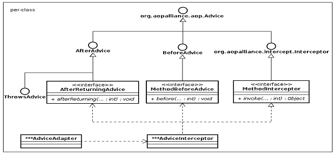

## 概念

wiki: 有时候也称包装样式或者包装(wrapper)。将一个类的接口转接成用户所期待的。一个适配使得因接口不兼容而不能在一起工作的类能在一起工作，做法是将类自己的接口包裹在一个已存在的类中。


## 实现代码
原有功能类
``` java
class Adaptee {
    public void methodB() {
    }
}
```
期待功能接口
``` java
interface Target {
    pubic void doWork();
}
```
适配器类
```java
class Adapter implements Target {
    
    private Adaptee adaptee;
    
    publiic Adapter(Adaptee adaptee) {
        this.adaptee = adaptee;
    }
    
    public void doWork() {
        adapee.methodB();
    }
}
```


## 开源项目中的应用

### JDK中java.util.Arrays#asList()

```java
public static <T> List<T> asList(T... a) {
        return new ArrayList<>(a);
}
```

### Spring中AdvisorAdapter

Advice（通知）的类型有：BeforeAdvice、AfterReturningAdvice、ThrowSadvice 等。每个类型 Advice（通知）都有对应的拦截器，MethodBeforeAdviceInterceptor、AfterReturningAdviceInterceptor、ThrowsAdviceInterceptor。Spring 需要将每个 Advice（通知）都封装成对应的拦截器类型，返回给容器，所以需要使用适配器模式对 Advice 进行转换。由于Advisor链需要的是MethodInterceptor ，所以每个Advisor中Advice需要适配成对应的MethodInterceptor。




期望获得MethodInterceptor，但是MethodBeforeAdvice无法实现。
```java
public interface MethodBeforeAdvice extends BeforeAdvice { 
  
 void before(Method method, Object[] args, Object target) throws Throwable; 
  
} 
```

创建Adapter进行适配，通过getInterceptor来获取期望的MethodInterceptor。
```java
class MethodBeforeAdviceAdapter implements AdvisorAdapter, Serializable {

	@Override
	public boolean supportsAdvice(Advice advice) {
		return (advice instanceof MethodBeforeAdvice);
	}
    // 期望获取一个MethodInterceptor，但是原有接口无法实现，
	@Override
	public MethodInterceptor getInterceptor(Advisor advisor) {
		MethodBeforeAdvice advice = (MethodBeforeAdvice) advisor.getAdvice();
		return new MethodBeforeAdviceInterceptor(advice);
	}
}
```

```java
public class DefaultAdvisorAdapterRegistry implements AdvisorAdapterRegistry, Serializable {

	private final List<AdvisorAdapter> adapters = new ArrayList<>(3);


	/**
	 * 注册适配器
	 */
	public DefaultAdvisorAdapterRegistry() {
		registerAdvisorAdapter(new MethodBeforeAdviceAdapter());
		registerAdvisorAdapter(new AfterReturningAdviceAdapter());
		registerAdvisorAdapter(new ThrowsAdviceAdapter());
	}
	
	@Override
	public MethodInterceptor[] getInterceptors(Advisor advisor) throws UnknownAdviceTypeException {
		List<MethodInterceptor> interceptors = new ArrayList<>(3);
		Advice advice = advisor.getAdvice();
		if (advice instanceof MethodInterceptor) {
			interceptors.add((MethodInterceptor) advice);
		}
		for (AdvisorAdapter adapter : this.adapters) {
		        // 使用适配器
			if (adapter.supportsAdvice(advice)) {
				interceptors.add(adapter.getInterceptor(advisor));
			}
		}
		if (interceptors.isEmpty()) {
			throw new UnknownAdviceTypeException(advisor.getAdvice());
		}
		return interceptors.toArray(new MethodInterceptor[0]);
	}

    @Override
	public void registerAdvisorAdapter(AdvisorAdapter adapter) {
		this.adapters.add(adapter);
	}
	....
}

```


## 使用场景

在软件开发中，也就是系统的数据和行为都正确，但接口不相符时，我们应该考虑用适配器，目的是使控制范围之外的一个原有对象与某个接口匹配。适配器模式主要应用于希望复用一些现存的类，但是接口又与复用环境要求不一致的情况。比如在需要对早期代码复用一些功能等应用上很有实际价值。适用场景大致包含三类：

1、已经存在的类的接口不符合我们的需求；

2、创建一个可以复用的类，使得该类可以与其他不相关的类或不可预见的类（即那些接口可能不一定兼容的类）协同工作；

3、在不对每一个都进行子类化以匹配它们的接口的情况下，使用一些已经存在的子类。

## 优缺点

- 优点

适配器模式也是一种包装模式，它与装饰模式同样具有包装的功能，此外，对象适配器模式还具有委托的意思。总的来说，适配器模式属于补偿模式，专用来在系统后期扩展、修改时使用。

- 缺点

过多的使用适配器，会让系统非常零乱，不易整体进行把握。比如，明明看到调用的是 A 接口，其实内部被适配成了 B 接口的实现，一个系统如果太多出现这种情况，无异于一场灾难。因此如果不是很有必要，可以不使用适配器，而是直接对系统进行重构。

## 参考文献

* [适配器模式原理及实例介绍](https://www.ibm.com/developerworks/cn/java/j-lo-adapter-pattern/index.html)

