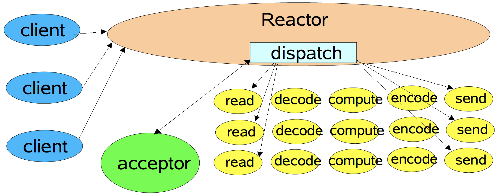
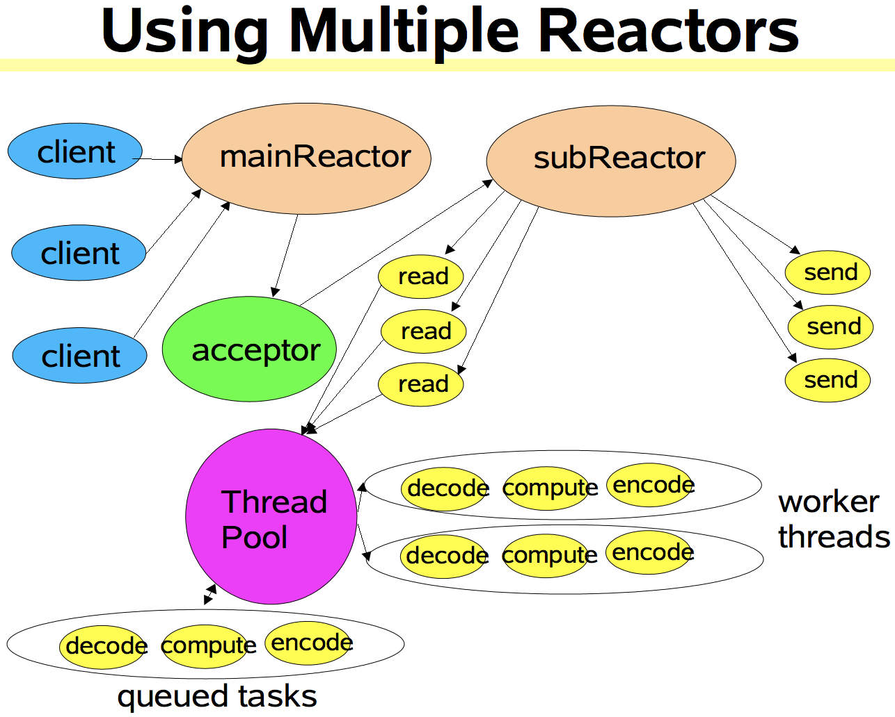

# Reactor

## 什么是 Reactor 模式

wiki：`“The reactor design pattern is an event handling pattern for handling service requests delivered concurrently by one or more inputs. The service handler then demultiplexes the incoming requests and dispatches them synchronously to associated request handlers.”`

## 为什么会有 Reactor 呢

对于应用程序而言，CPU 的处理速度是远远快于 IO 的速度的。如果CPU为了IO操作（例如从Socket读取一段数据）而阻塞显然是不划算的。好一点的方法是分为多进程或者线程去进行处理，但是这样会带来一些进程切换的开销，试想一个进程一个数据读了500ms，期间进程切换到它3次，但是CPU却什么都不能干，就这么切换走了，是不是也不划算？

这时先驱们找到了事件驱动，或者叫回调的方式，来完成这件事情。这种方式就是，应用业务向一个中间人注册一个回调（event handler），当IO就绪后，就这个中间人产生一个事件，并通知此handler进行处理。这种回调的方式，也体现了“好莱坞原则”（Hollywood principle）-“Don’t call us, we’ll call you”，在我们熟悉的IoC中也有用到。看来软件开发真是互通的！

## Reactor 应用场景

Reactor 核心是解决多请求问题。一般来说，Thread-Per-Connection 的应用场景并发量不是特别大，如果并发量过大，会导致线程资源瞬间耗尽，导致服务陷入阻塞，这个时候就需要 Reactor 模式来解决这个问题。Reactor 通过多路复用的思想大大减少线程资源的使用。

## Reactor 结构

上图是 Reactor 模型，主要涉及的类：

- `Initiation Dispatcher`：EventHandler 的容器，用来注册、移除 EventHandler 等；另外，它作为 Reactor 模式的入口调用 Synchronous Event Demultiplexer 的 select 方法以阻塞等待事件的返回，当阻塞事件返回时，将事件发生的 Handle 分发到相应的 EvenHandler 处理。
- `Even Handler`：定义了事件处理的方法。
- `Handle`：即操作系统中的句柄，是对资源在操作系统层面上的一种抽象，它可以是打开的文件、一个连接(Socket)、Timer等。
- `Synchronous Event Demultiplexer`：使用一个事件循环 ，以阻止所有的资源。当可以启动一个同步操作上的资源不会阻塞，多路分解器发送资源到分发器。

## Reactor 时序图

1. 初始化 InitationDispatcher，并初始化一个Handle到EventHandler的Map。
2. 注册 EvenHandler 到 InitationDispatcher，每个 EventHandler 包含对相应 Handle 的引用，从而建立Handle到EventHandler的映射（Map）。
3. 调用 InitiationDispatcher 的 handle_events() 方法以启动 Event Loop。在 Event Loop 中，调用 select()方法（Synchronous Event Demultiplexer）阻塞等待Event发生。
4. 当某个或某些 Handle 的 Event 发生后，select() 方法返回，InitiationDispatcher 根据返回的Handle找到注册的 EventHandler ，并回调该 EventHandler 的 handle_events() 方法。
5. 在 EventHandler 的 handle_events() 方法中还可以向 InitiationDispatcher 中注册新的 Eventhandler，比如对 AcceptorEventHandler 来说，当有新的 client 连接时，它会产生新的 EventHandler 以处理新的连接，并注册到 InitiationDispatcher 中。

## Reactor 模式

### 单线程 Reactor 模式

**简单来说，接收请求和处理请求是同一线程中处理。**

对于一些小容量应用场景，可以使用单线程模型。但是对于高负载、大并发或大数据量的应用场景却不合适，主要原因如下：
① 一个NIO线程同时处理成百上千的链路，性能上无法支撑，即便NIO线程的CPU负荷达到100%，也无法满足海量消息的读取和发送；
② 当NIO线程负载过重之后，处理速度将变慢，这会导致大量客户端连接超时，超时之后往往会进行重发，这更加重了NIO线程的负载，最终会导致大量消息积压和处理超时，成为系统的性能瓶颈；

### 多线程 Reactor 模式

**简单来说，接收请求和处理请求是不同线程中处理。**

mainReactor 一般只有一个，主要负责接收客户端的连接并将其传递给 subReactor。subReactor  一般会有多个，主要负责处理与客户端的通信。

注意：上图使用了`Thread Pool`来处理耗时的业务逻辑，提高Reactor线程的I/O响应，不至于因为一些耗时的业务逻辑而延迟对后面I/O请求的处理。

## Reactor 的优缺点

优点：

1. 大多数设计模式的共性：解耦、提升复用性、模块化、可移植性、事件驱动、细力度的并发控制等。
2. 更为显著的是对性能的提升，即不需要每个 Client 对应一个线程，减少线程的使用。

缺点：

1. 相比传统的简单模型，Reactor增加了一定的复杂性，因而有一定的门槛，并且不易于调试。
2. Reactor模式需要底层的Synchronous Event Demultiplexer支持，比如Java中的Selector支持，操作系统的select系统调用支持，如果要自己实现Synchronous Event Demultiplexer可能不会有那么高效。
3. Reactor模式在IO读写数据时还是在同一个线程中实现的，即使使用多个Reactor机制的情况下，那些共享一个Reactor的Channel如果出现一个长时间的数据读写，会影响这个Reactor中其他Channel的相应时间，比如在大文件传输时，IO操作就会影响其他Client的相应时间，因而对这种操作，使用传统的Thread-Per-Connection或许是一个更好的选择，或则此时使用Proactor模式。

## Reactor 代码实现

## 参考文献

- [Netty源码解读（四）Netty与Reactor模式](http://ifeve.com/netty-reactor-4/)
- [Reactor模式详解](http://www.blogjava.net/DLevin/archive/2015/09/02/427045.html)
- [Scalable IO In Java](http://gee.cs.oswego.edu/dl/cpjslides/nio.pdf)
- [Reactor模式详解＋源码实现](https://www.jianshu.com/p/188ef8462100)
- [Netty 那些事儿 ——— Reactor模式详解](https://www.jianshu.com/p/1ccbc6a348db)