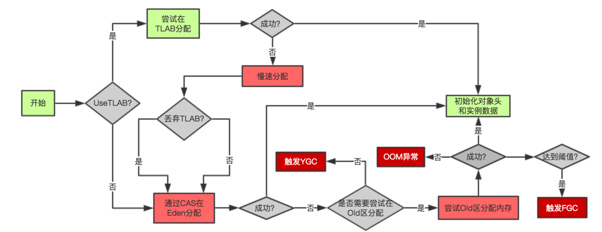

# jvm gc

## gc算法

### 1. 标记-清除

分为标记和清除两个阶段： 首先标记出所有需要回收的对象，然后统一进行回收。
不足：1. 标记和清除效率低。2. 易产生不连续的内存碎片，不利于大对象的分配。

### 2. 复制

针对标记-清除的优化：将内存分为两块，只在其中一块进行内存分配，当发生gc，将其中存活的对象复制到另一块并将当前块全部回收。

目前大部分jvm也是这样做的：1个Eden空间和2个Survivor空间。。由于新生代中大部分的对象98%是“朝生夕死”，故Survivor较小。如果Survivor不足以存放gc时存活的对象，则需要进行分配担保，将对象放入老年代中。

不足： 会浪费一定的内存空间，如Survivor。

### 3. 标记-整理

顾名思义。不会产生不连续的内存碎片。

### 4. 分代收集 

根据对象存活周期的不同将内存划分为几块。例如新生代和老年代。不同年代选用适当的收集算法。

## 垃圾收集器

### 1. Serial

"serial":串行。其是单线程的**新生代**垃圾收集器，这意味着STW。

### 2. ParNew

Serial的并行多线程版本。是 Server 模式下首选的新生代收集器，除了性能原因外，主要是因为除了 Serial 收集器，只有它能与 CMS 收集器配合工作。

### 3. Parallel Scavenge

新生代，复制算法，并行。其目标是达到可控制的吞吐量。吞吐量 = 运行用户代码时间 /（运行用户代码时间 + 垃圾收集时间）。   
主要有两个参数，控制最大垃圾收集停顿时间的-XX:MaxGCPauseMillis和直接设置吞吐量大小的-XX:GCTimeRatio。  
通过MaxGCPauseMillis缩短GC停顿时间是牺牲吞吐量和新生代的空间实现：将新生代调小，会缩短GC停顿时间，但是会提高GC频率。 
另外使用-XX:+UseAdaptiveSizePolicy自适应调节达到指定吞吐量或者GC停顿时间，不用手动指定新生代-Xmx,-XX:SurvivorRatio等参数了。

### 4. Serial Old

Serial的**老年代**版本。主要用于与Parallel Scavenge搭配使用以及CMS后配方案。

### 5. Parallel Old

Parallel Scavenge的**老年代**版本。注重吞吐量以及CPU资源敏感的场合，优先考虑Parallel Old和Parallel Scavenge的组合。

### 6. CMS

Concurrent Mark Sweep，标记-清除。分为4个阶段： 初始标记，并发标记，重新标记，并发清除。并发标记和并发清除的速度最慢，但是与用户线程同时进行。初始标记和重新标记会短暂STW	。

缺点：
1. cpu敏感。默认启动的线程数是（CPU数量+3）/4，如果只有两个，那么就要分出一个核去执行垃圾回收，速度直接慢了一半。
2. 无法处理浮动垃圾，可能发生“Concurrent Mode Failure”而导致Full GC。由于垃圾收集线程和用户线程并发进行，对于标记后产生的垃圾无法在当次收集中处理，这种垃圾叫做浮动垃圾。因为并发的特性，CMS不能像其他垃圾收集器一样等到老年代满了才收集，需要预留一部分内存空间给用户线程，-XX:CMSInitiatingOccupancyFractions设置触发收集百分比。当预留空间无法满足用户线程时，发生“Concurrent Mode Failure”导致触发JVM后备方案：临时启动Serail Old进行垃圾收集，停顿时间较长。
3. 由于是标记-清理，易产生内存碎片。但可以通过-XX:CMSFullGCsBeforeCompaction设置多少次不压缩的Full GC后进行一次压缩，相当于整理了。

### 7. G1

面向服务端，总体上标记-整理。并发与并行。分代收集。空间整合。可预测的停顿。分为4个阶段：初始标记，并发标记，最终标记，筛选回收。 

新的概念：Region。使用G1的话，Java堆划分成多个大小相等的独立区域Region。G1维护回收价值优先级Region列表，优先回收价值最大的Region以保证GF(Garbage-First)收集器在优先的时间段内获取尽可能高的回收效率。降低了GC停顿时间。

### GC流程图

## link

[cs-notes](https://cyc2018.github.io/CS-Notes/#/notes/Java%20虚拟机)
[图解GC](https://xie.infoq.cn/article/9d4830f6c0c1e2df0753f9858)
