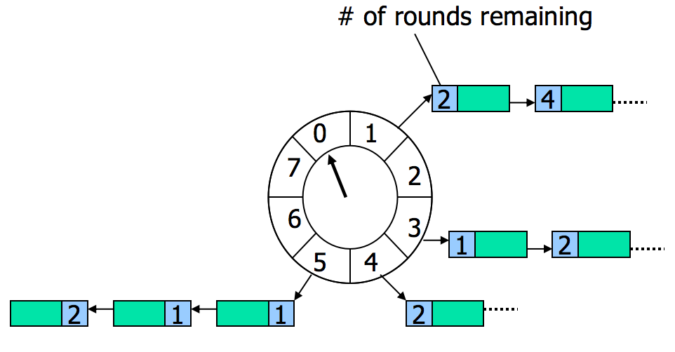

# netty HashedWheelTimer

## 原理



由上可见其2个要素：`环形数组`和`链表`

## Timer初始化

```java
public HashedWheelTimer(
      	ThreadFactory threadFactory,
        long tickDuration, TimeUnit unit, int ticksPerWheel, boolean leakDetection,
        long maxPendingTimeouts) {

	······
	// ticksPerWheel的二次幂为Wheel上的节点数量，tickDuration表示每个节点时间跨度
    wheel = createWheel(ticksPerWheel);
    mask = wheel.length - 1;

    // Convert tickDuration to nanos.
    this.tickDuration = unit.toNanos(tickDuration);

    // Prevent overflow.
    if (this.tickDuration >= Long.MAX_VALUE / wheel.length) {
        throw new IllegalArgumentException(String.format(
                "tickDuration: %d (expected: 0 < tickDuration in nanos < %d",
                tickDuration, Long.MAX_VALUE / wheel.length));
    }
    // 初始化worker，用于轮询触发任务
    workerThread = threadFactory.newThread(worker);

    leak = leakDetection || !workerThread.isDaemon() ? leakDetector.track(this) : null;

    this.maxPendingTimeouts = maxPendingTimeouts;
    // 不宜创建过多的timer实例
    if (INSTANCE_COUNTER.incrementAndGet() > INSTANCE_COUNT_LIMIT &&
        WARNED_TOO_MANY_INSTANCES.compareAndSet(false, true)) {
        reportTooManyInstances();
    }
}
```

## Wheel

### 结构

```java
private static final class HashedWheelBucket {
    // Used for the linked-list datastructure
    private HashedWheelTimeout head;
    private HashedWheelTimeout tail;

    ······
}
```
head 和 tail 就形成了链表，其链表节点代表着延时任务。故 Wheel 每个节点可以含有多个任务。

### 添加/触发任务

先看下任务结构

```java
private static final class HashedWheelTimeout implements Timeout {
	// 任务状态常量
    private static final int ST_INIT = 0;
    private static final int ST_CANCELLED = 1;
    private static final int ST_EXPIRED = 2;
    private static final AtomicIntegerFieldUpdater<HashedWheelTimeout> STATE_UPDATER =
            AtomicIntegerFieldUpdater.newUpdater(HashedWheelTimeout.class, "state");

    // 所属 timer	
    private final HashedWheelTimer timer;
    // 任务实际载体
    private final TimerTask task;
    // 倒计时。开始时间为timer worker的启动时间
    private final long deadline;

    @SuppressWarnings({"unused", "FieldMayBeFinal", "RedundantFieldInitialization" })
    private volatile int state = ST_INIT;

   	// 剩余轮数，下面介绍
    long remainingRounds;

    HashedWheelTimeout next;
    HashedWheelTimeout prev;
    // wheel节点
    HashedWheelBucket bucket;
}
```
可以看出链表为双向链表


添加任务只是简单的链表添加节点操作，而激活任务不仅仅只是删除节点:

```java
public void expireTimeouts(long deadline) {
    HashedWheelTimeout timeout = head;

    // process all timeouts
    while (timeout != null) {
        HashedWheelTimeout next = timeout.next;
        if (timeout.remainingRounds <= 0) {
            next = remove(timeout);
            if (timeout.deadline <= deadline) {
            	// 执行任务
                timeout.expire();
            } else {
                // The timeout was placed into a wrong slot. This should never happen.
                throw new IllegalStateException(String.format(
                        "timeout.deadline (%d) > deadline (%d)", timeout.deadline, deadline));
            }
        } else if (timeout.isCancelled()) {
            next = remove(timeout);
        } else {
            timeout.remainingRounds --;
        }
        timeout = next;
    }
}

```
`remainingRounds`是HashedWheel的关键。任务激活的判断条件为：`timeout.remainingRounds <= 0`


在初始化Timer时，每个Wheel节点代表duration，通过hash: `dealline%duration` 确定其属于哪个Wheel节点。那如何确定`remainingRounds`呢？可能有人会这样：`dealline/duration/wheelSize`。这个是错的，需要搞清楚 dealline 是怎么来的。
```java
long deadline = System.nanoTime() + unit.toNanos(delay) - startTime;
```
startTime是worker线程启动的时间，由于任务激活的判断条件如上，故剩余轮数应该为 `(dealline-worker已经工作时长)/duration/wheelSize`。如果`dealline/duration/wheelSize`作为`remainingRounds`，那么条件要做相应的更改：`timeout.remainingRounds - worker已转了轮数`

## Worker

```java
private final class Worker implements Runnable {
    private final Set<Timeout> unprocessedTimeouts = new HashSet<Timeout>();
    // worker经过的wheel节点数
    private long tick;

    @Override
    public void run() {
        // 初始化 startTime, 用于计算deadline
        startTime = System.nanoTime();
        if (startTime == 0) {
            // We use 0 as an indicator for the uninitialized value here, so make sure it's not 0 when initialized.
            startTime = 1;
        }

        // Notify the other threads waiting for the initialization at start().
        startTimeInitialized.countDown();

        do {
            final long deadline = waitForNextTick();
            if (deadline > 0) {
            	// 得到当前应处理的wheel节点
                int idx = (int) (tick & mask);
                processCancelledTasks();
                HashedWheelBucket bucket =
                        wheel[idx];
                transferTimeoutsToBuckets();
                // 触发任务
                bucket.expireTimeouts(deadline);
                tick++;
            }
        } while (WORKER_STATE_UPDATER.get(HashedWheelTimer.this) == WORKER_STATE_STARTED);
        
        ······
    }
}
```


