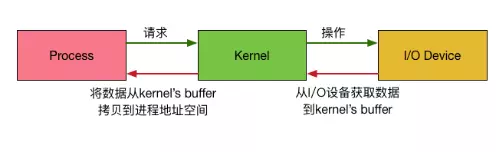

# netty 

## nio

整个请求过程为： 用户进程发起请求，内核接受到请求后，从I/O设备中获取数据到buffer中，再将buffer中的数据copy到用户进程的地址空间，该用户进程获取到数据后再响应客户端。

在整个请求过程中，数据输入至buffer需要时间（ready），而从buffer复制数据至进程也需要时间(copy)。

bio一个连接对应一个线程，严重依赖线程。I/O操作（Read,Write,Accept等）是阻塞的，因为内核空间和用户空间不能直接操作，数据需要进行拷贝，导致这部分的阻塞时间内线程白白阻塞。这样就成为高并发量的瓶颈。I/O操作的阻塞时间主要由等待事件(ready)和内存拷贝(copy)两部分组成。而内存拷贝一般可以忽略不计。 故主要阻塞在于等待。

nio的出现主要是为了提高并发量，并不会提高响应的速度。其使用I/O多路复用模式，使用一个线程轮询已经准备好的事件然后通知用户线程去处理，避免所有的线程都阻塞，节约了线程资源。

## EventLoop

## channel

### nio channel

## handler

### inbound

### onbound

## buffer

## link 
[Dealing With Long Time Task Such As SQL Query In Netty](https://stackoverflow.com/questions/37474482/dealing-with-long-time-task-such-as-sql-query-in-netty)  
[NIO基础](https://juejin.im/post/5a41951af265da43176a6270)  
[Java NIO浅析](https://zhuanlan.zhihu.com/p/23488863)  
 
